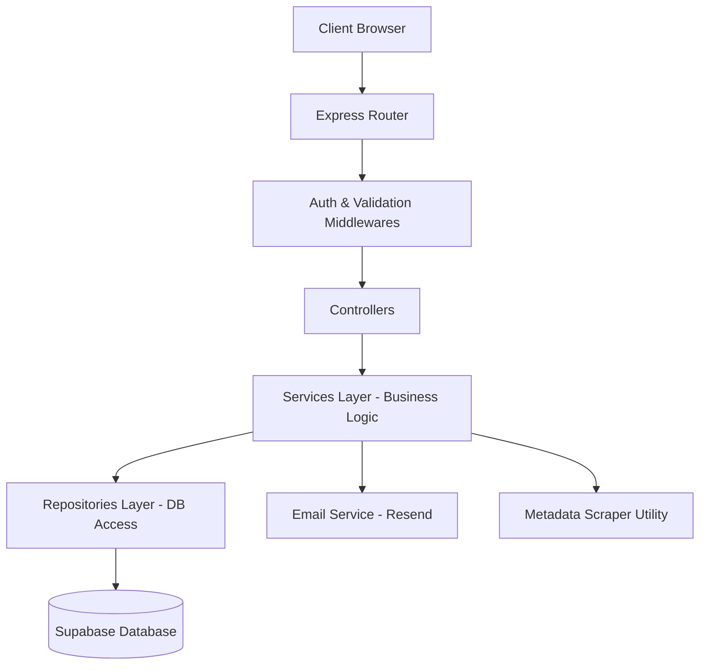

# EagerMinds Bookmarks App — Implementation & Architecture Plan

This document outlines the architecture, patterns, and implementation stages of the personal bookmarks application.

---

## 1. Technical Stack & Architecture

We have implemented a **decoupled client-server architecture**:
* **Frontend**: React SPA (bootstrapped with Vite, utilizing Vanilla CSS modules for premium aesthetics and standard routing).
* **Backend**: Node.js & Express REST API server.
* **Database & Auth**: Supabase (PostgreSQL with Row Level Security (RLS) policies and triggers).
* **Emails**: Resend (dispatches welcome emails upon signups).
* **Local Workspace**: Integrated scripts configured in a root `package.json` to handle simultaneous installation, execution, and testing.

---

## 2. Backend Architecture Design Patterns

To build a maintainable, clean code structure, the backend uses the **Repository-Service-Controller Pattern**:

### Layer Definitions:
1. **Router Layer (`backend/routes/`)**: Receives the requests and maps endpoints to controllers.
2. **Middleware Layer (`backend/middlewares/`)**: Intercepts requests for authentication checking (`auth.js`) and parameter validation (`validation.js`).
3. **Controller Layer (`backend/controllers/`)**: Extract inputs (query/body/headers) and formats output using a unified `response.js` utility. Delegates business logic execution to the services.
4. **Service Layer (`backend/services/`)**: Implements business calculations (such as handle formatting, scraping web details using `metadataScraper.js`, checking token details, calling email dispatchers).
5. **Repository Layer (`backend/repositories/`)**: Encapsulates raw Supabase client queries. Prevents controllers or service files from writing database statements directly.
6. **Centralized Error Handling**: Custom `AppError` class tracks status codes and marks errors as operational or server failures.

---

## 3. Database Schema & Supabase Configuration

### Tables:
1. **Profiles**:
   * `id` (uuid, primary key, references `auth.users`)
   * `handle` (text, unique, lowercase, min 3 characters)
   * `email` (text, not null)
   * `created_at` (timestamp with time zone)
2. **Bookmarks**:
   * `id` (uuid, primary key)
   * `user_id` (uuid, references `profiles.id`, not null)
   * `title` (text, not null)
   * `url` (text, not null)
   * `description` (text)
   * `favicon_url` (text)
   * `is_public` (boolean, default false)
   * `created_at` (timestamp with time zone)

### Row Level Security (RLS) Policies:
* **Profiles**:
  * Read (`SELECT`): Permitted publicly (needed to display dynamic profile handles).
  * Mutate (`UPDATE`/`DELETE`): Permitted only if the authenticated user's ID matches the profile ID.
* **Bookmarks**:
  * Read (`SELECT`): Permitted if the bookmark is marked public (`is_public = true`) OR if the authenticated user owns it (`auth.uid() = user_id`).
  * Mutate (`INSERT`/`UPDATE`/`DELETE`): Permitted only if the authenticated user owns the bookmark (`auth.uid() = user_id`).

---

## 4. Frontend Architecture Design Patterns

The React SPA utilizes modern design paradigms:
1. **Custom Hooks (`frontend/src/hooks/`)**:
   * `useAuth`: Centralizes loading state, token reading from `localStorage`, session validation, and logout navigation.
2. **Modular Utility Files (`frontend/src/utils/`)**:
   * `date.js`: Exports human-readable formatting helpers.
3. **Reusable Template Components (`frontend/src/components/`)**:
   * `BookmarkManager`: Inline editing cards, status filter buttons (All, Public, Private), and real-time search filtering.
   * `SearchProfile`: Debounced handle search bar on the Home page.
4. **Aesthetics & Glassmorphism**: Global styles in `index.css` defining dynamic glow variables, layout resets, interactive states, and glass background cards.

---

## 5. Testing Strategy & Execution

We verify all core mechanics using automated unit and integration tests:
* **Backend**: Jest and Supertest.
  * Mocks Supabase Auth/DB client connections to test route operations in isolation.
  * 26 tests covering input validation rules, session endpoints, CRUD operations, dynamic handle checks, and reserved keyword protections.
* **Frontend**: Vitest.
  * Mocks the global `fetch` interface and browser `localStorage` to verify token insertion and request formatting.
* **Execution**: Run all tests via the root-level workspace runner `npm test`.
