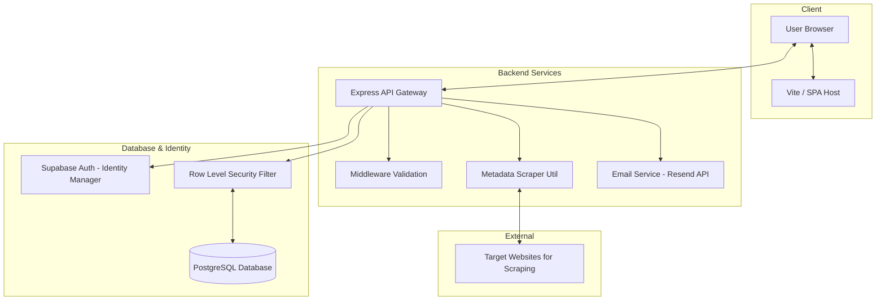
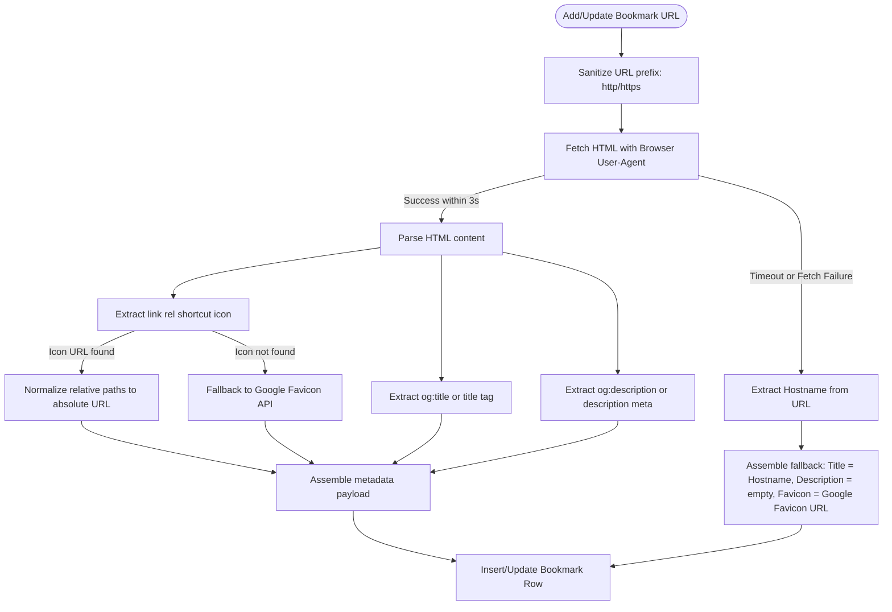
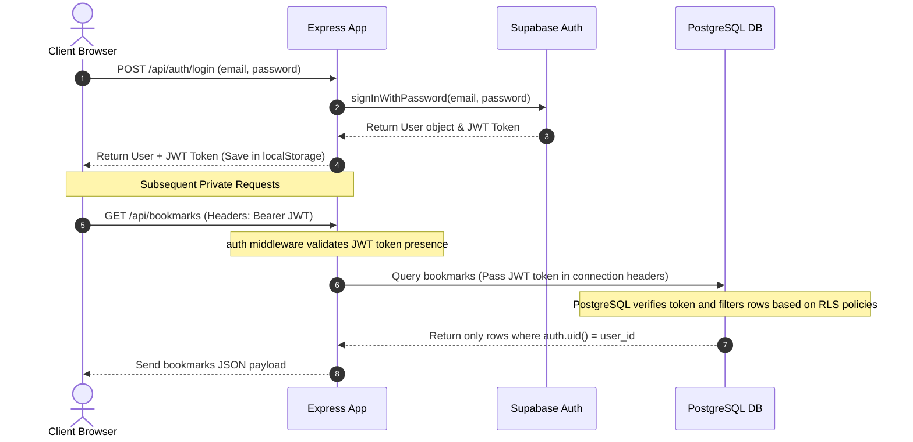

# EagerMinds Bookmarks Application — System Design Document

This document defines the system design, data architecture, security models, pipelines, and infrastructure workflows of the EagerMinds Bookmarks Application.

---

## 1. System Architecture Overview

The system is designed as a decoupled client-server architecture. The frontend React Single Page Application (SPA) serves the interactive layout, while the Node.js/Express backend handles data processing, metadata scraping, email notifications, and proxy verification.



---

## 2. Database Design & Entity Relationship Diagram (ERD)

The database schema is structured inside Supabase's PostgreSQL engine. The design links PostgreSQL user management to a custom profile entity via user metadata triggers.

```mermaid
erDiagram
    auth_users {
        uuid id PK
        string email
        string encrypted_password
    }
    profiles {
        uuid id PK, FK "references auth.users"
        string handle UNIQUE "lowercase"
        string email
        timestamp created_at
    }
    bookmarks {
        uuid id PK
        uuid user_id FK "references profiles.id"
        string title
        string url
        string description
        string favicon_url
        boolean is_public
        timestamp created_at
    }

    auth_users ||--|| profiles : "triggers profile creation"
    profiles ||--o{ bookmarks : "owns"
```

### Profile Creation Trigger Workflow:
When a user signs up via Supabase Auth, a PostgreSQL trigger automatically executes the `handle_new_user()` function:
1. It attempts to extract the `@handle` from user metadata.
2. If none is provided, it falls back to the email prefix (e.g., `john` from `john@domain.com`).
3. It cleans the handle (lowercases it and removes non-alphanumeric characters).
4. If a conflict occurs, it appends a sequential suffix (e.g., `john1`, `john2`) to guarantee handle uniqueness.

---

## 3. Row Level Security (RLS) & Access Control Matrix

Security is enforced at the database level using PostgreSQL Row Level Security (RLS) policies. This ensures that even if API keys or client parameters are manipulated, Supabase rejects unauthorized data operations.

```
+------------------+-----------------------------+-------------------------------------------------+
| Table            | Action                      | RLS Policy Condition                            |
+------------------+-----------------------------+-------------------------------------------------+
| public.profiles  | SELECT                      | true (viewable publicly)                        |
|                  | INSERT / UPDATE / DELETE    | auth.uid() = id                                 |
+------------------+-----------------------------+-------------------------------------------------+
| public.bookmarks | SELECT                      | auth.uid() = user_id OR is_public = true        |
|                  | INSERT                      | auth.uid() = user_id                            |
|                  | UPDATE                      | auth.uid() = user_id                            |
|                  | DELETE                      | auth.uid() = user_id                            |
+------------------+-----------------------------+-------------------------------------------------+
```

---

## 4. Metadata Scraper Pipeline (Scraper Service)

When adding or updating a bookmark, the backend automatically extracts target metadata to populate descriptions and favicons. The scraping process operates as follows:



---

## 5. User Authentication & JWT Flow

We use JSON Web Tokens (JWT) issued by Supabase Auth to verify client sessions and maintain row-level security.



---

## 6. Frontend Module & State Management Design

The React client utilizes custom hooks to isolate component rendering from session states:

* **Session Manager (`useAuth` Hook)**:
  * Mounts a single `useEffect` loop that runs on app load.
  * Checks for the presence of a token in `localStorage`.
  * Fetches the user profile and session validation via `/api/auth/me`.
  * Exposes global states (`user`, `profile`, `loading`, `logout`) to pages.
* **Date Utilities (`date` Util)**:
  * Decoupled utility to convert database timestamptz formats to locale dates (e.g., `Jan 10, 2026`).
* **Router Mapping (`App.jsx`)**:
  * `/`: `Home` Page (Lookup public profiles).
  * `/login`: `Login` Page (Submit credentials, save token).
  * `/signup`: `Signup` Page (Choose `@handle`, trigger email dispatcher).
  * `/dashboard`: `Dashboard` Page (Private bookmark management).
  * `/:handle`: `Profile` Page (Loads public profile and public-only bookmarks).

---

## 7. Infrastructure & Deployment Setup

* **Vercel Hosting**:
  * Frontend React application is compiled via `vite build` into static assets, served on Vercel Edge networks.
  * Backend Node.js/Express server is run on Vercel Serverless Functions.
* **Environment Variables**:
  * **Backend**: `SUPABASE_URL`, `SUPABASE_ANON_KEY`, and `RESEND_API_KEY` are injected via Vercel Dashboard secrets.
  * **Frontend**: `VITE_API_BASE_URL` points to the hosted API URL.
